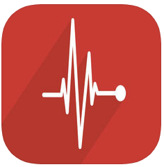
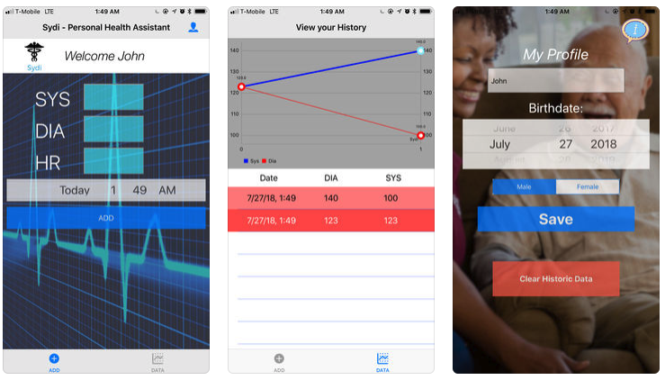

# Sydi ❤️ 📈 - Personal Health Assistant 

### by [John Misirlakis](https://www.linkedin.com/in/misirlakis/) & [Christopher Chung](https://www.linkedin.com/in/christopher-j-chung/)

### Free, No-Ads, Open Source, on-device data, offline and server-less! 
  * [coredata](https://developer.apple.com/documentation/coredata) - for on device storing of data  
  * [Charts](https://cocoapods.org/pods/Charts) - Graph representation
  

   &nbsp; &nbsp;

Sydi is free on the App Store!

Category | Health & Fitness
--------: | :---------
Size | 12.5 MB
Compatibility | Requires iOS 11.4 or later. Compatible with iPhone, iPad, and iPod touch.
Language | English
Age Rating | 4+
Copyright | © 2018 Chris and John
Price | Free

v1.0
